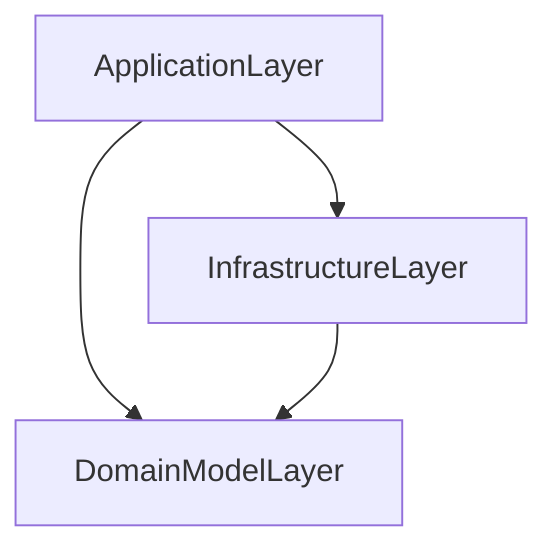

# Project Structure

## Design a DDD-oriented microservice

Source:

- [https://learn.microsoft.com/en-us/dotnet/architecture/microservices/microservice-ddd-cqrs-patterns/ddd-oriented-microservice](https://learn.microsoft.com/en-us/dotnet/architecture/microservices/microservice-ddd-cqrs-patterns/ddd-oriented-microservice)
- [https://learn.microsoft.com/en-us/dotnet/architecture/microservices/microservice-ddd-cqrs-patterns/net-core-microservice-domain-model](https://learn.microsoft.com/en-us/dotnet/architecture/microservices/microservice-ddd-cqrs-patterns/net-core-microservice-domain-model)

## Overview

## Application Layer

- ASP.NET Web API
- Network access to microservice
- API contracts/implementation
- Commands and command hanlders
- Queries (when using a CQS approach)

## Domain Model Layer

- Ideally, it must NOTE take dependency on any other layer.
- Plain Old Class Objects (POCO)
- Domain Entities with data + behaviour
- DDD patterns
  - Domain entity, aggregate
  - Aggregate root, value object
  - Repository contracts/interfaces

## Infrastructure Layer

- Data Persistence Infrastructure
    - Repository Implementation
- Use of ORMs or data access API
    - Entity Framework Core or any ORM
    - ADO.NET
    - Any NoSQL database API
    - Other infrastructure implementation used form the application layer
      - Logging
